# Compezze – Contest Platform (Microservices)

A comprehensive platform to gather communitty, plan events, for creating and managing contests with smaller services to create quizzes, and surveys in real-time.
As contest is main functionality, it contains stages, which could be other sessions (quizzes, surveys, public voting, jury voting, generic timer like break etc.)
The system is built on a microservices architecture using **Spring Boot (Backend)** and **React (Frontend)**.

Whole 'production' application can be found here : https://github.com/Banjo7331/Compezze-fullstack

---

# 🏗️ System Architecture

The system operates in a distributed model where the **API Gateway** serves as the single entry point for the Frontend.  
Communication between services occurs:

- Synchronously → REST (Feign)
- Asynchronously → WebSocket / Events

## Main Components

- **Frontend (SPA)** – React (Vite, TypeScript, Material UI)  
- **API Gateway** – Routing, JWT verification, CORS  
- **Discovery Service (Eureka)** – Service registry  
- **Microservices**: Auth, Contest, Quiz, Survey  
- **Infrastructure**:
  - PostgreSQL – Main database  
  - Redis – Cache, Live Rankings  
  - MinIO (S3) – File storage  

---

# 💻 Frontend – View Structure

SPA built with React + Vite. Organized by features.

## Auth

- `/login` – Login  
- `/register` – Register  

### 📸 Screenshots (Auth)
| Login | Register |
|--------------|--------------|
| 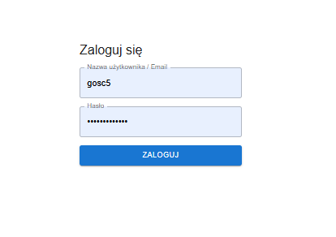 | 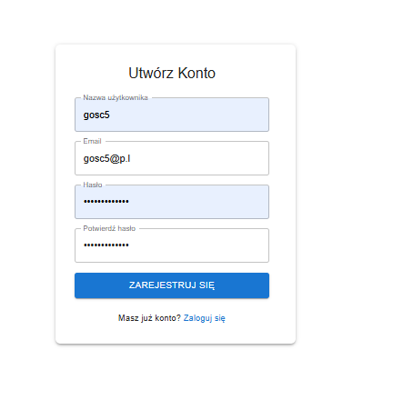 |


---

## Contest Hub

- `/contest` – Main page, list of contests  
- With its subpages for other features  

### 📸 Screenshots (Contest)
| Main page | Form view | Host Panel |
|--------------|--------------|--------------|
| 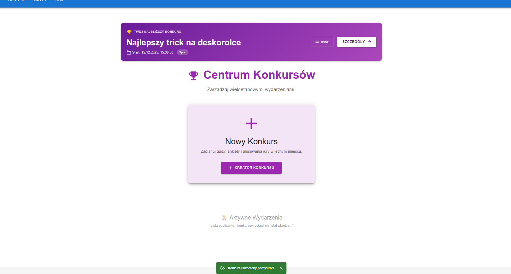 | 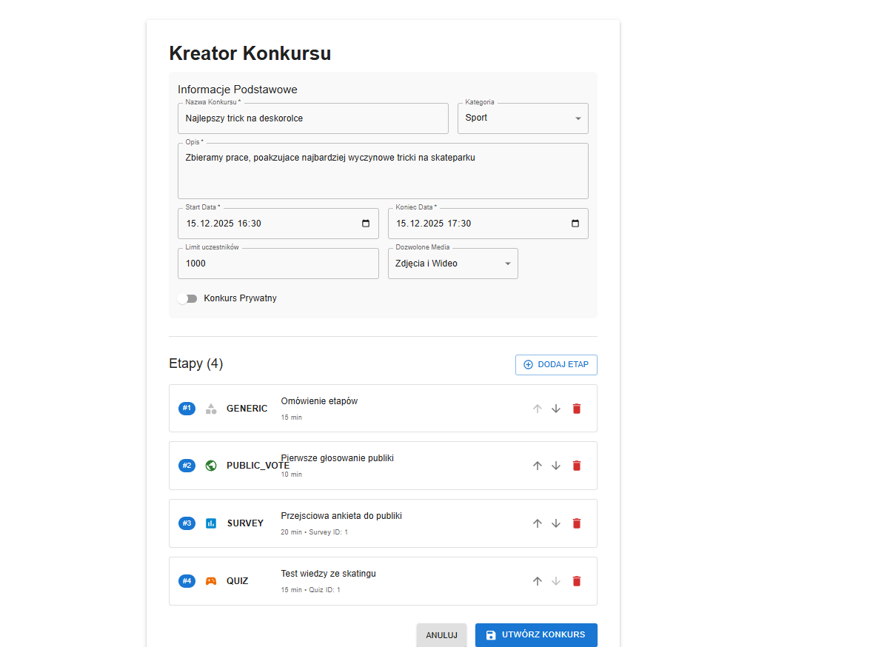 | 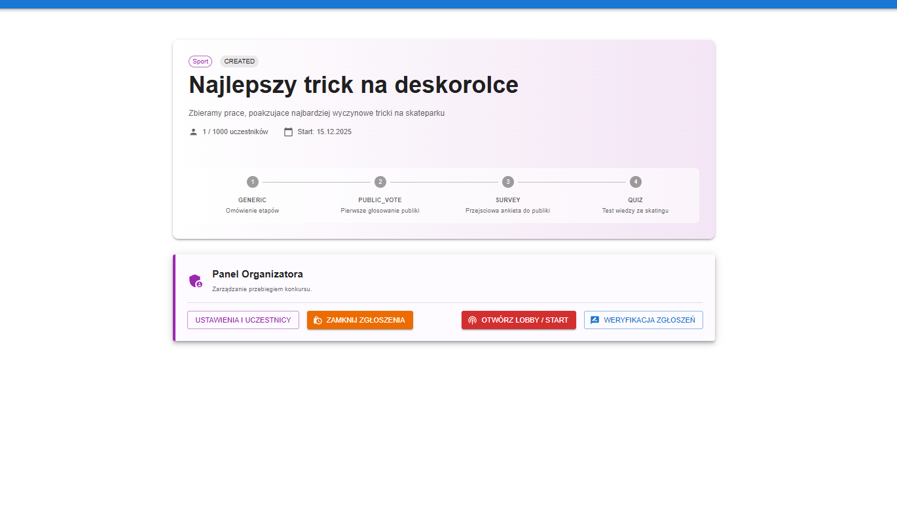 |

---

## Quiz

- `/quiz/` – Quiz page, list of quizzes  
- With its subpages for other features  

### 📸 Screenshots (Quiz)
| Quiz Form | Participant view | Host view |
|--------------|--------------|--------------|
| 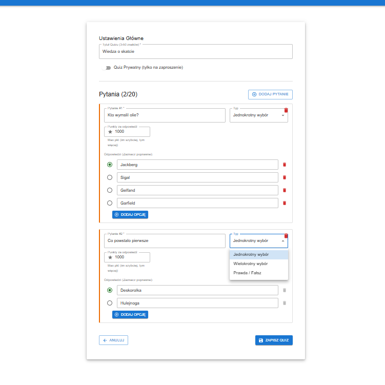 | 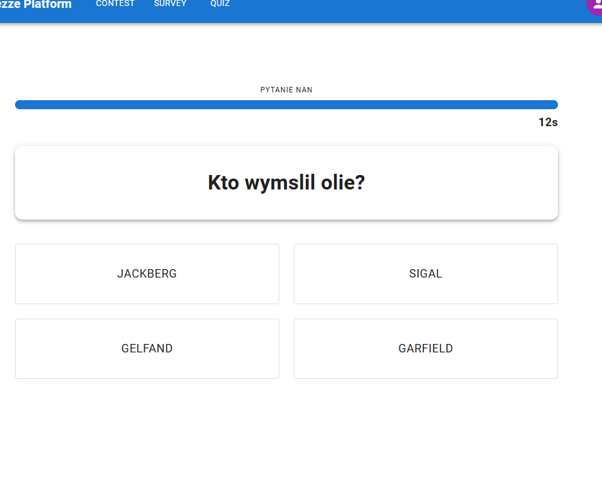 | 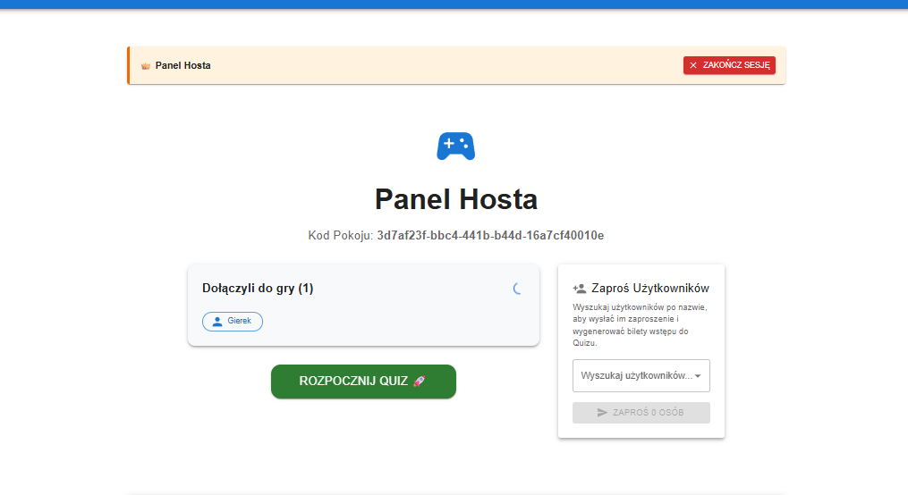 |

---

## Survey

- `/survey/` – Survey page, list of surveys  
- With its subpages for other features  

### 📸 Screenshots (Survey)
| Survey page | Participant view | Host view |
|--------------|--------------|--------------|
| 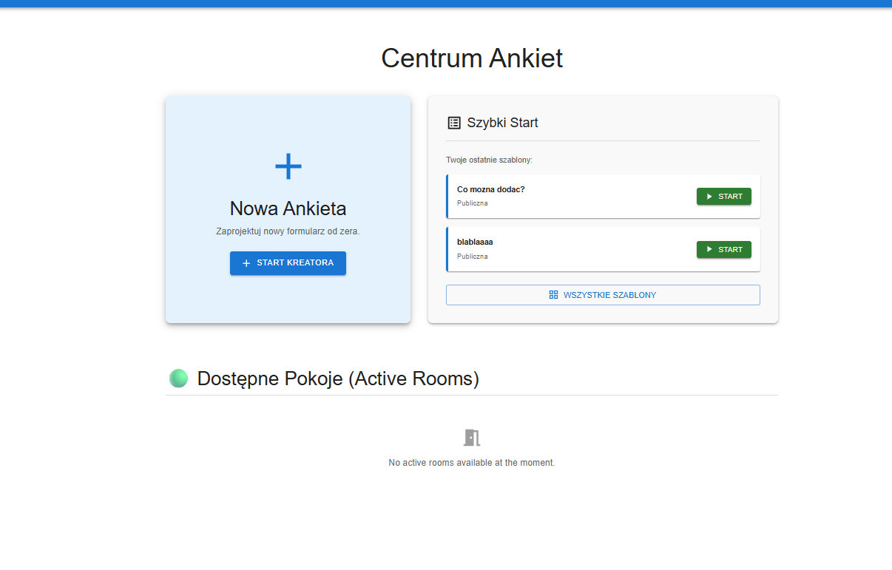 | 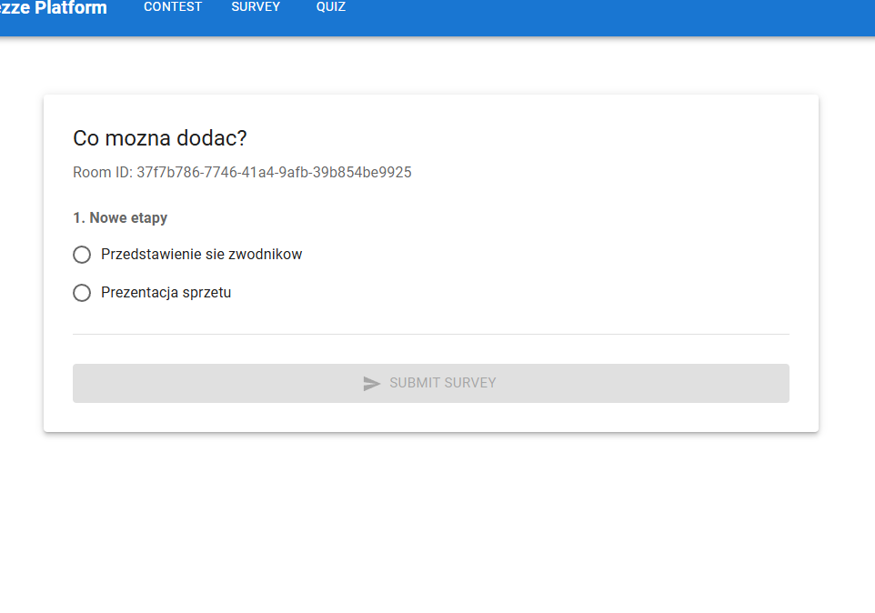 | 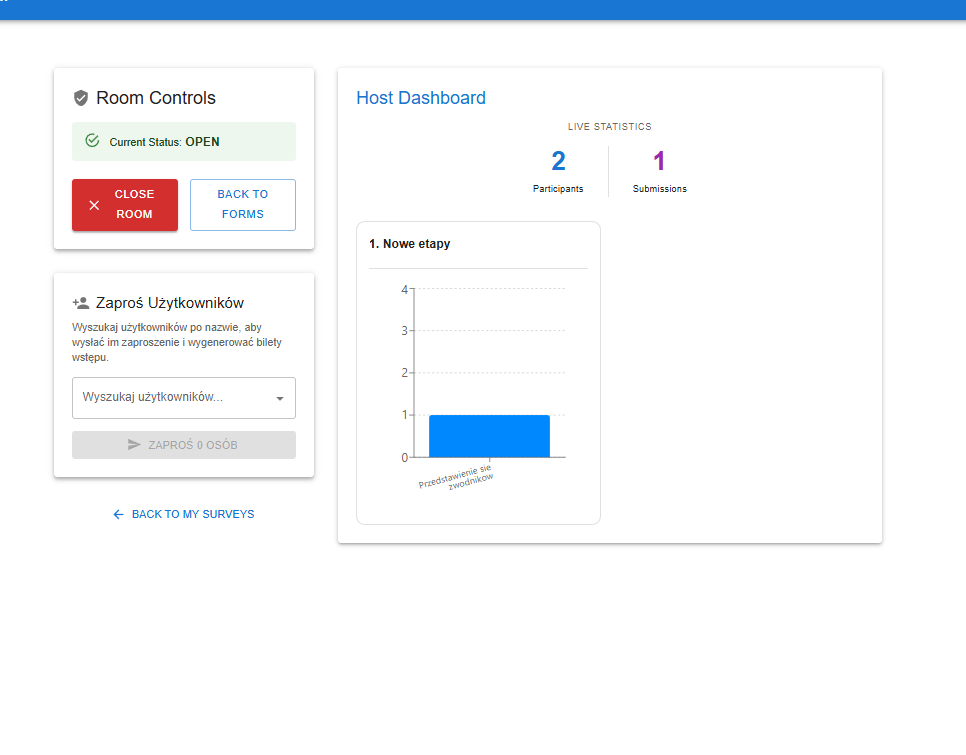 |

---

## Profile

- `/profile/` – User account page (account actions, room results, created forms etc.)

### 📸 Screenshots (Profile)
| Survey view | Survey room Results | Quiz room Reuslts |
|--------------|--------------|--------------|
| 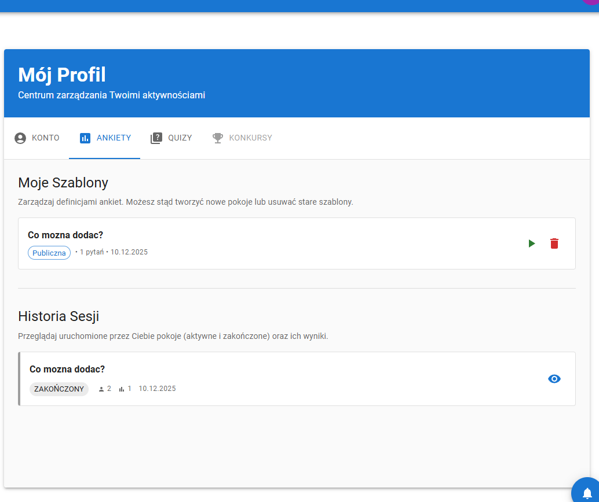 | 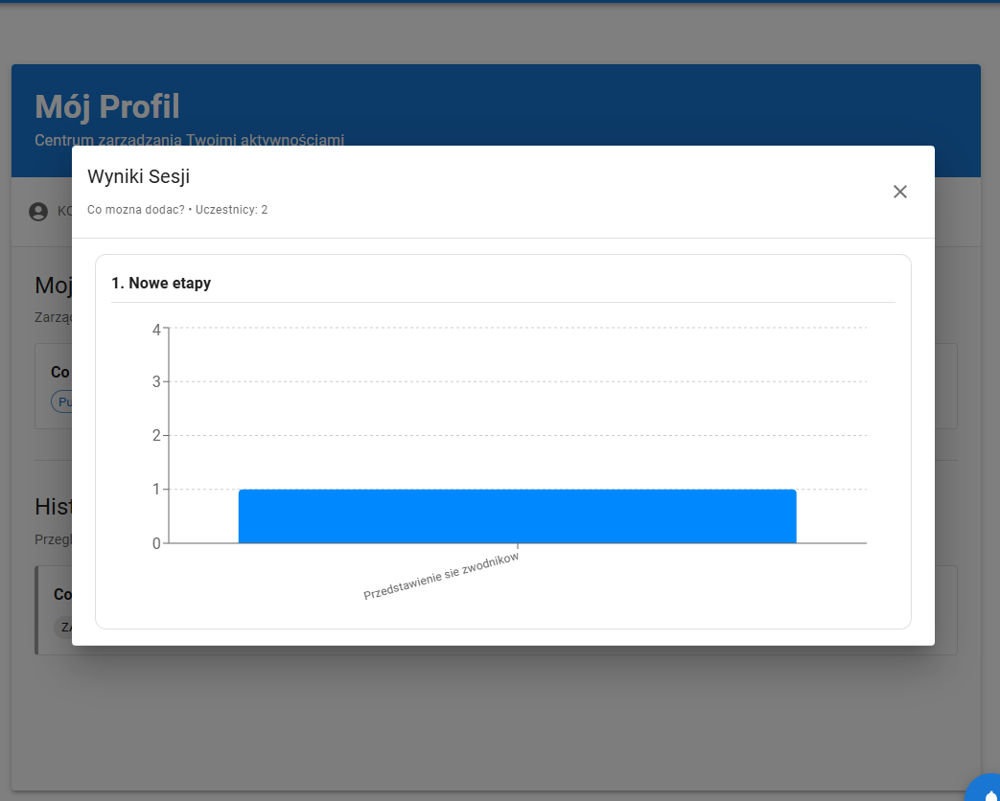 |  |

---

# 🛠️ Running the Project (Dev)

## Requirements

- Docker & Docker Compose
- Node.js 20+  

---

## 1. Start Infrastructure

```sh
npm run dev
